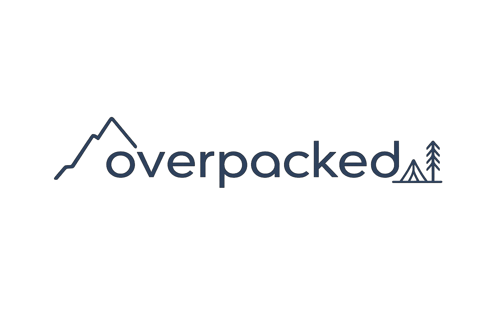

<p align="center">
  
</p>

<p align="center">
  <strong>Plan what you carry. Stop overpacking.</strong>
</p>

<p align="center">
  A self-hosted app for backpackers to catalog their gear, build packs, and plan trips —
  with weight and volume tracked every step of the way.
</p>

<p align="center">
  <a href="LICENSE.md"></a>
  
  
</p>

---

## What is overpacked?

**overpacked** helps you build a personal library of your backpacking gear and turn it into
well-planned, weight-aware packs for every trip. Add your tent, stove, sleeping bag and the rest
once, then mix and match them into packs for each person on each trip. The app keeps a running
total of pack weight and volume so you always know what you're carrying — and how it compares to
a healthy load for the person carrying it.

It's **self-hosted** and **single-user**: your gear data lives on your own server.

## Features

- **🎒 Gear catalog** — Track every item with its weight, volume, manufacturer, custom type, and
  a photo. Add your own tags (labels) to organize and filter your collection.
- **📦 Sets & packing lists** — Group items you always take together (a cook kit, a first-aid
  kit) and reuse them to assemble packs in seconds.
- **🗺️ Trips, people & packs** — Plan multi-person journeys. Each person can carry multiple
  packs, with every item marked as **packed** or **worn**. Record trip type (day hike, overnight,
  multi-day, thru-hike), duration, distance, and route links.
- **⚖️ Smart weight guidance** — Get a recommended pack weight for each person based on their
  body weight, age, gender, and fitness — using a [science-informed formula](docs/backpack-weight-calc.md)
  that goes beyond the simple "10% rule".
- **📏 Weight & volume tracking** — Totals roll up automatically across items, sets, and packs.
- **🔎 Global search** — Fuzzy search across your items, sets, people, and trips.
- **💾 Backups & export** — Export and re-import all your data, schedule automatic backups, and
  export your gear list to CSV.
- **🌐 Your units** — Choose metric or imperial; the app converts for display while keeping your
  data consistent under the hood.
- **📱 Works on the trail** — Responsive, mobile-friendly interface for last-minute checks
  before you head out.

## Getting started

The fastest way to run overpacked is with Docker Compose. You'll need
[Docker](https://docs.docker.com/get-docker/) installed.

```bash
# 1. Grab the deployment files
cd deployment

# 2. Create your environment file and edit the secrets
cp .env.example .env
#   -> set POSTGRES_PASSWORD, APP_PASSWORD, and JWT_SECRET (min 32 chars)
#   -> optionally change APP_USERNAME (defaults to "admin")

# 3. Start it up
docker compose up -d
```

Then open **http://localhost:8080** and log in with the username and password from your `.env`.

### Configuration

The app is configured entirely through environment variables (see
[`deployment/.env.example`](deployment/.env.example)):

| Variable            | Required | Default      | Description                                   |
| ------------------- | :------: | ------------ | --------------------------------------------- |
| `POSTGRES_PASSWORD` |    ✅    | —            | Password for the PostgreSQL database.         |
| `APP_PASSWORD`      |    ✅    | —            | Your login password.                          |
| `JWT_SECRET`        |    ✅    | —            | Secret for signing sessions (use 32+ chars).  |
| `APP_USERNAME`      |          | `admin`      | Your login username.                          |
| `POSTGRES_USER`     |          | `postgres`   | PostgreSQL username.                           |
| `POSTGRES_DB`       |          | `overpacked` | PostgreSQL database name.                      |

### Deploying to Kubernetes

A Helm chart (bundling [CloudNativePG](https://cloudnative-pg.io/) for the database) is available
under [`deployment/helm/overpacked-app`](deployment/helm/overpacked-app/). See its
[README](deployment/helm/overpacked-app/README.md) for values and installation instructions.

## Contributing

Contributions are welcome! This is an open-source project under active development.

- Read **[CONTRIBUTING.md](CONTRIBUTING.md)** for the development setup, the fork-based pull
  request flow, and coding conventions.
- Found a bug or have an idea? Open an issue.
- Developers: the [`Makefile`](Makefile) has everything you need to run the stack locally
  (`make up`), run tests (`make test`), and seed sample data (`make seed`).

## License

overpacked is licensed under the **GNU Affero General Public License v3.0**. See
[LICENSE.md](LICENSE.md) for the full text.

---

> 🤖 **Built with AI.** This project was generated with the assistance of AI coding tools.
